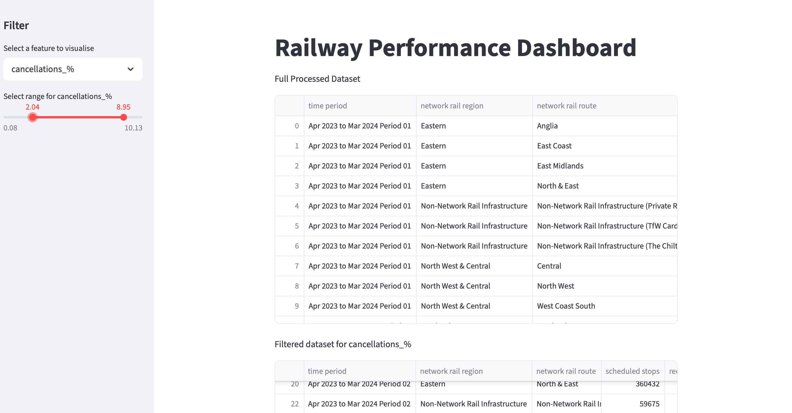
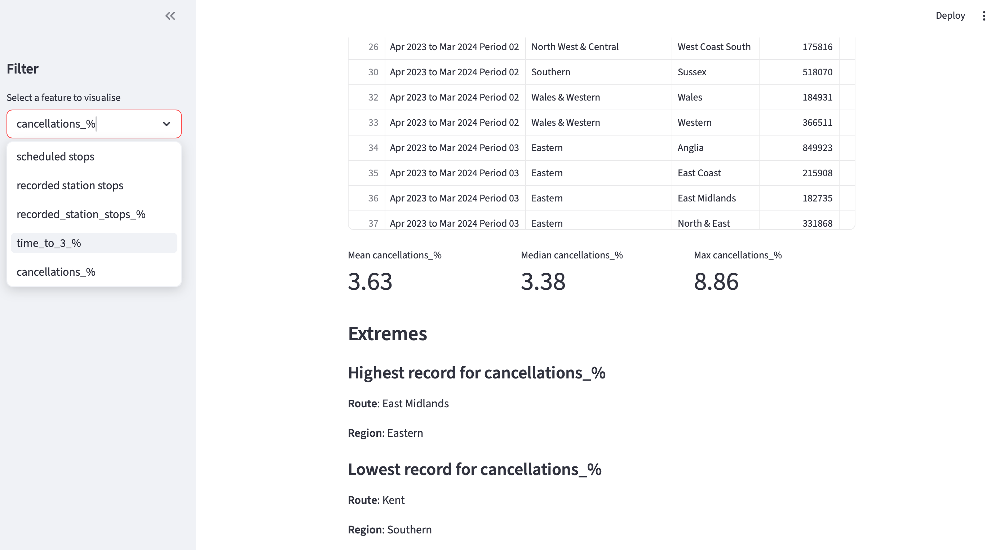

# ETL Pipeline for Rail Performance Data

## Overview
This project implements an end-to-end ETL (Extract, Transform, Load) pipeline in Python to process UK rail performance data. It automates data ingestion, cleaning, and transformation across multiple datasets and uses CI/CD automation to generate structured outputs for analysis. The final dataset is visualised through an interactive Streamlit dashboard for exploratory analysis of railway performance metrics by route and region.

### Data Source
The data source contains public sector information licensed under the Open Government Licence v3.0 from the Office of Rail and Road:
https://dataportal.orr.gov.uk/performance

## Tech Stack
- Python (pandas, numpy)
- Excel (multi-sheet datasets)
- GitHub Actions (CI/CD automation)
- Azure DevOps Pipeline
- Streamlit (data visualisation)

## ETL Process
### 1. Extract
- Loads multi-sheet Excel workbooks
- Reads all sheet names dynamically
- Excludes non-data sheets (e.g. notes, cover pages)

### 2. Transform
- Removes empty or irrelevant columns
- Standardises column names (lowercase, trimmed, consistent formatting)
- Handles inconsistent values (e.g. “[u]”, “[z]”)
- Adds `source_sheet` for traceability

### 3. Load
- Outputs cleaned data as CSV files
- File naming includes:
  -  Cleaned sheet name
  -  Processing date
- Saves outputs locally and as CI/CD artifacts

### Data Flow Architecture
This diagram shows the end-to-end data pipeline from raw Excel data through transformation and automation to final outputs.

## Automation (CI/CD)
#### GitHub Actions Pipeline
The ETL pipeline is automated using GitHub Actions and runs:
- On every push to the `main` branch
- On a daily schedule (08:00 AM)
- Manually via workflow dispatch
  
#### Pipeline Steps:
1. Checkout repository
2. Set up Python environment
3. Install dependencies
4. Run ETL script
5. Upload cleaned outputs as artifacts

### Error Handling & Robustness
The pipeline is designed for robustness:
  - Handles missing or non-numeric sheets gracefully
  - Skips empty datasets without failing 
  - Prints errors and processing steps to console
  - Ensures failure in one sheet does not interrupt full execution

### Pipeline Workflow 

## Streamlit Dashboard

### Future Improvements / Planned Features
- Add schema validation for input data
- Introduce structured logging
- Add unit tests for transformation logic
- Deploy dashboard on Streamlit Cloud

### Key Skills Demonstrated
- ETL pipeline design and implementation
- Data cleaning and transformation with pandas
- Handling real-world and inconsistent multi-sheet datasets
- CI/CD automation (GitHub Actions, Azure DevOps)
- Data engineering workflow design
- Interactive dashboard development with Streamlit
  

