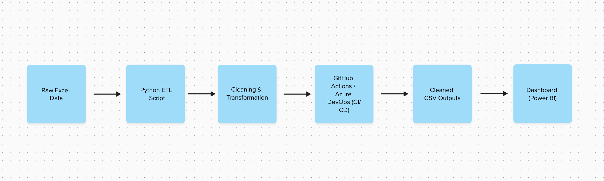
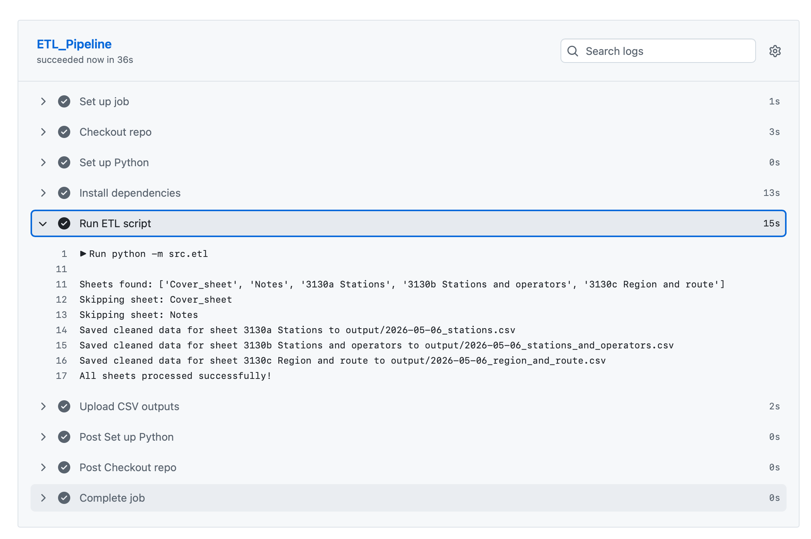

# ETL Pipeline for Rail Performance Data (Multi-Sheet Excel)

## Overview
This project demonstrates an end-to-end ETL (Extract, Transform, Load) pipeline built in Python to process UK rail performance data stored across multiple Excel sheets. The pipeline automates data cleaning and transformation to produce structured outputs suitable for analysis and dashboarding.

The goal is to simulate a lightweight data engineering workflow with CI/CD automation and reproducible data processing.

### Data Source
The data source contains public sector information licensed under the Open Government Licence v3.0 from the Office of Rail and Road:
https://dataportal.orr.gov.uk/statistics/performance/passenger-rail-performance/

## Tech Stack
- Python (pandas, numpy)
- Excel (multi-sheet datasets)
- GitHub Actions (CI/CD automation)
- Azure DevOps Pipeline
- _Planned_ Power BI (for visualisation)

## ETL Process
### 1. Extract
- Loads an Excel workbook containing multiple sheets
- Dynamically reads all sheet names
- Excludes non-data sheets (e.g. notes, cover pages)

### 2. Transform
- Removes empty or irrelevant columns
- Standardises column names (lowercase, trimmed, consistent formatting)
- Handles inconsistent values (e.g. “[u]”, “[z]” placeholders)
- Adds a `source_sheet` column to preserve traceability across datasets

### 3. Load
- Outputs cleaned data as CSV files
- File naming includes:
  -  Cleaned sheet name
  -  Processing date
- Saves outputs locally and as CI/CD artifacts

### Data Flow Architecture
This diagram shows the end-to-end data pipeline from raw Excel data through transformation and automation to final outputs.

## Automation (CI/CD)
#### GitHub Actions Pipeline
The ETL Process is fully automated using GitHub Actions and runs:
- On every push to the `main` branch
- On a daily schedule (8:00 AM)
- Manually via workflow dispatch
  
#### Pipeline Steps:
1. Checkout repository
2. Set up Python environment
3. Install dependencies
4. Run ETL script
5. Upload cleaned CSV outputs as artifacts

This ensures consistent and reproducible data processing.

### Error Handling & Robustness
The pipeline is designed to be robust:
  - Handles missing or non-numeric sheets gracefully
  - Skips empty datasets without failing the pipeline
  - Logs errors and processing steps to console
  - Ensures failure in one sheet does not interrupt full execution

### Pipeline Workflow 
This image shows how the ETL script is executed automatically through GitHub Actions.

### Future Improvements
Planned next steps include:
- Build interactive dashboards using Power BI or Tableau
- Add schema validation for input data
- Replace print-based logging with structured logging
- Introduce unit tests for transformation logic
- Store processed outputs in a database instead of CSV files

### Key Skills Demonstrated
- ETL pipeline design and implementation
- Data cleaning and transformation using pandas
- Working with real-world multi-sheet datasets
- CI/CD automation using GitHub Actions and Azure DevOps
- Basic data engineering workflow design
  

